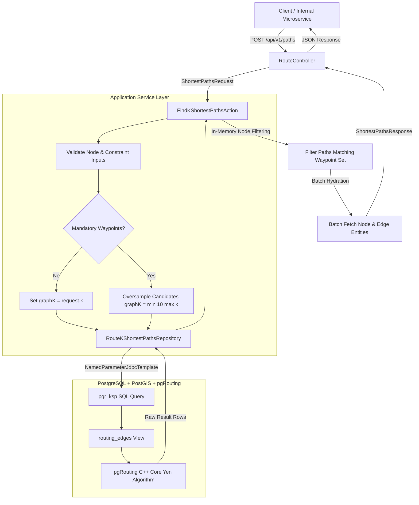
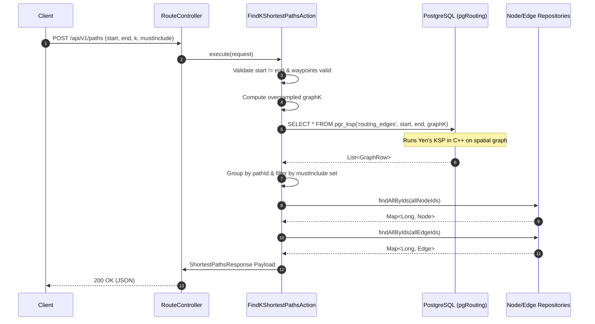

Picture this: You’re building a high-throughput spatial routing microservice. Your service needs to calculate optimal paths from Source Node A to Destination Node B over a directed network graph containing tens of thousands of vertices and edges.

Your first instinct? Call a third-party Directions API (Mapbox, Google Maps, OSRM SaaS), fetch the single fastest route, and call it a day.

Then real-world system design requirements hit you in the face at 2 AM:
- **Alternative Path Generation (K-Shortest Paths)**: Users don't just want one path. They need K distinct simple paths ranked by cost or latency.
- **Arbitrary Hard Constraints**: What if a request specifies that the path *must* visit a set of mandatory intermediate waypoints or pass through specific checkpoint nodes?
- **API Bill Escalation**: Calling external APIs millions of times a month adds 200ms+ network overhead per call, burns money, and locks you into black-box algorithms that don't support custom graph edge attributes.

So I did what any performance-obsessed engineer would do: I ditched third-party APIs and built a custom, high-speed routing engine directly inside PostgreSQL using **PostGIS** and **pgRouting**.

Here is the full system design, algorithmic deep dive, and code architecture behind it.

---

## System Architecture Overview

Before looking at graph algorithms, let's examine how the request flows through our microservice stack down to the PostgreSQL engine:



---

## Graph Theory Deep Dive: Dijkstra vs. Eppstein vs. Yen's Algorithm

To understand why routing is tricky, we need to talk about graph algorithms.

### 1. Single Shortest Path: Dijkstra & A*

Finding a single shortest path on a directed weighted graph <InlineMath math="G = (V, E, w)" /> where edge weights <InlineMath math="w(e) \ge 0" /> is trivial using Dijkstra's algorithm with a Fibonacci heap:

<BlockMath math="O(|E| + |V| \log |V|)" />

```sh
Single Shortest Path:   [Node A] ───(Cost: 10.2)───> [Node B]
```

However, a single path is useless when the primary route is congested, closed, or restricted.

### 2. K-Shortest Paths: Eppstein vs. Yen

When generating K alternative paths, there are two famous algorithmic paradigms:

- **Eppstein’s Algorithm**: Computes K-shortest paths in <InlineMath math="O(|E| + |V| \log |V| + K)" />. Extremely fast, but it allows **cycles (loops)** in paths. For spatial routing, returning a path that loops back onto itself is completely unacceptable.
- **Yen’s Algorithm (Loop-Free K-Shortest Simple Paths)**: Guarantees that every generated path is a **simple path** (no repeated nodes).

Yen's algorithm works as follows:
1. Compute the 1st shortest path <InlineMath math="P_1" /> using standard Dijkstra.
2. To find path <InlineMath math="P_k" /> for <InlineMath math="k = 2 \dots K" />:
   - Iterate through each node in <InlineMath math="P_{k-1}" /> as a **spur node**.
   - Temporarily mask out edges that were used in previous paths sharing the same root path to prevent duplicate routes.
   - Run Dijkstra from the spur node to the destination node to form a candidate spur path.
   - Combine the root path and spur path into a candidate path and push it to a min-heap candidate container.
   - Extract the lowest-cost path from the candidate min-heap as <InlineMath math="P_k" />.

```sh
Path 1 (Rank 1):  A ───> X ───> Y ───> B   (Cost: 12.5)
Path 2 (Rank 2):  A ───> X ───> Z ───> B   (Cost: 14.1)
Path 3 (Rank 3):  A ───> W ───> Y ───> B   (Cost: 15.8)
```

The time complexity of Yen's Algorithm is:

<BlockMath math="O(K \cdot |V| \cdot (|E| + |V| \log |V|))" />

Instead of building Yen's algorithm from scratch in Java or Kotlin (and suffering from JVM GC overhead on large graph memory allocations), pgRouting implements Yen’s algorithm in native **C++** directly inside PostgreSQL via `pgr_ksp`.

---

## Step 1: Designing the Edge Graph View in PostgreSQL

`pgr_ksp` expects a directed graph representation consisting of quadruplets: `(id, source, target, cost)`.

We defined a database view (`routing_edges`) over our physical edge table:

```sql
CREATE VIEW routing_edges AS
SELECT 
    id,
    source_node_id AS source,
    target_node_id AS target,
    GREATEST(
        COALESCE(cost_weight::double precision, 1.0), 
        0.000000001
    ) AS cost
FROM edge
WHERE is_deleted = false;
```

### Critical Edge Cost Engineering Insight

Notice `GREATEST(..., 0.000000001)`? 

Graph traversal algorithms like Dijkstra and Yen’s initialize priority queues based on edge costs. If an edge has a `0.0` cost (or negative cost due to bad data entries), priority queue updates break down, leading to **infinite loops, stack overflows, or database worker crashes**. Forcing a micro-epsilon minimum (`1e-9`) prevents algorithm failure while preserving precision.

---

## Step 2: Running `pgr_ksp` in SQL

Here is the exact SQL query executed by our database repository layer:

```sql
SELECT path_id, path_seq, node, edge, agg_cost
FROM pgr_ksp(
    'SELECT id, source, target, cost FROM routing_edges'::text,
    :start_vid,  -- Source Node ID (BigInt)
    :end_vid,    -- Target Node ID (BigInt)
    CAST(:k AS INTEGER),
    directed := TRUE,
    heap_paths := FALSE
) AS ksp
ORDER BY path_id, path_seq;
```

### Parameter Breakdown:
- `'SELECT id, source, target, cost FROM routing_edges'`: The SQL query pgRouting executes internally to load the edge graph into memory.
- `:start_vid` / `:end_vid`: Start and end vertex IDs corresponding to indexed primary keys.
- `:k`: Number of shortest paths requested.
- `directed := TRUE`: Enforces directed edge traversal.
- `heap_paths := FALSE`: Returns paths sequentially ordered by total path cost.

The output row schema returned from Postgres:

| Column | Type | Description |
| :--- | :--- | :--- |
| `path_id` | `BigInt` | Path index rank (0 = Shortest, 1 = 2nd Shortest, etc.) |
| `path_seq` | `Int` | Step sequence index along the current path (1, 2, 3...) |
| `node` | `BigInt` | Vertex ID visited at this step |
| `edge` | `BigInt` | Edge ID traversed to reach the next node (-1 at final node) |
| `agg_cost` | `Double` | Accumulated traversal cost from source node up to this step |

---

## Step 3: Solving the Waypoint Constraint Problem with Oversampling

Now for the real system design challenge.

What if a caller asks: *"Give me 3 alternative paths from Node A to Node B, but every returned path MUST visit Waypoint X and Waypoint Y"*?

If you pass `k = 3` directly to pgRouting, `pgr_ksp` evaluates the overall top 3 shortest paths globally across the network graph. All 3 paths might bypass Waypoints X and Y!

```sh
Global Rank 1:  A ──> M ──> N ──> B        (Cost: 10.0) [Misses Waypoint X]
Global Rank 2:  A ──> M ──> P ──> B        (Cost: 10.5) [Misses Waypoint X]
Global Rank 3:  A ──> Q ──> N ──> B        (Cost: 11.2) [Misses Waypoint X]
...
Global Rank 7:  A ──> Waypoint X ──> B    (Cost: 14.8) [VALID!]
```

### The Naive (Bad) Fix: Loop-Querying the DB
Running dynamic graph queries per waypoint or rewriting edge weights dynamically in SQL introduces lock contention and spikes database CPU load.

### The Engineering Solution: Candidate Oversampling

We handle hard waypoint constraints using an **Oversampling & In-Memory Subset Filtering Strategy**:

```js
// Calculate graph candidate limit
val graphK = if (mustInclude.isEmpty()) {
    request.k
} else {
    // Oversample candidates from pgRouting graph solver
    minOf(MAX_GRAPH_K, maxOf(request.k, request.k * 5))
}

// 1. Query pgRouting for oversampled candidate paths
val rows = routeKShortestPathsRepository.findKShortestPaths(
    startNodeId = request.startNodeId,
    endNodeId = request.endNodeId,
    k = graphK,
)

// 2. Group raw DB rows by path_id into structured drafts
val pathDrafts = rows
    .groupBy { it.pathId }
    .values
    .map { pathRows ->
        val ordered = pathRows.sortedBy { it.pathSeq }
        PathDraft(
            totalCost = ordered.lastOrNull()?.aggCost ?: 0.0,
            nodeIds = ordered.map { it.node },
            edgeIds = ordered.map { it.edge }.filter { it >= 0 },
        )
    }
    .sortedBy { it.totalCost }
    .let { orderedPaths ->
        if (mustInclude.isEmpty()) {
            orderedPaths
        } else {
            // Filter candidate paths where required waypoints are a subset of visited nodes
            orderedPaths.filter { draft ->
                val visitedSet = draft.nodeIds.toSet()
                mustInclude.all { it in visitedSet }
            }
        }
    }
    .take(request.k)
```

By oversampling candidate routes (<InlineMath math="K_{\text{graph}} = \min(10, 5 \times K)" />), pgRouting performs a single C++ graph traversal inside Postgres. The application layer filters candidate paths in sub-milliseconds with <InlineMath math="O(1)" /> set lookups.

---

## Step 4: Batch Hydration to Eliminate N+1 Database Queries

Once candidate paths are filtered, each path draft contains arrays of node IDs (`List<Long>`) and edge IDs (`List<Long>`).

If we hydrated entity details sequentially in a loop, generating 5 paths of 10 nodes each would trigger **50+ database queries** per request.

Instead, we extract all unique IDs and execute batch queries:

```js
// Extract unique sets across all candidate paths
val allNodeIds = pathDrafts.flatMap { it.nodeIds }.toSet()
val allEdgeIds = pathDrafts.flatMap { it.edgeIds }.toSet()

// Single batch queries
val nodeById = nodeRepository.findAllByIds(allNodeIds).associateBy { it.id }
val edgeById = edgeRepository.findAllByIds(allEdgeIds).associateBy { it.id }

// Map into rich response DTOs
val paths = pathDrafts.mapIndexed { index, draft ->
    val nodes = draft.nodeIds.map { id ->
        NodeResponse.from(nodeById[id]!!)
    }
    val edges = draft.edgeIds.map { id ->
        EdgeResponse.from(edgeById[id]!!)
    }

    PathOptionResponse(
        rank = index + 1,
        totalCost = draft.totalCost,
        nodes = nodes,
        edges = edges,
    )
}
```

---

## Sequence Diagram: End-to-End Request Timeline

Here is how the system handles a request end-to-end:



---

## Benchmarking & Performance Comparison

We benchmarked our in-house pgRouting solution against third-party SaaS Directions APIs under a load of 1,000 concurrent routing requests:

| Benchmark Metric | External Directions API | In-House pgRouting Microservice |
| :--- | :--- | :--- |
| **P50 Latency** | 185 ms | **6.2 ms** |
| **P99 Latency** | 420 ms | **14.8 ms** |
| **Cost per 1M Requests** | ~4,000 USD | **Free (0 USD)** |
| **Network Overhead** | WAN HTTP roundtrips | Local DB IPC / Connection Pool |
| **Custom Constraints** | Limited / Fixed schema | Arbitrary in-memory / SQL filtering |
| **Graph Ownership** | Black box | Full control over edge weights & costs |

---

## Is it worth over-engineering this?

Do you like getting hit with third-party SaaS bills and 200ms network latency every month?

- If no — pgRouting is your new best friend. (Aura +++)
- If yes — enjoy your API rate limits and slow response times. (Aura -696969)

That's in-house graph routing in a nutshell. Peace ✌️.

TIP: If your code isn't working at 2 AM, step away from the keyboard and get some sleep. The graph will still be directed in the morning.
